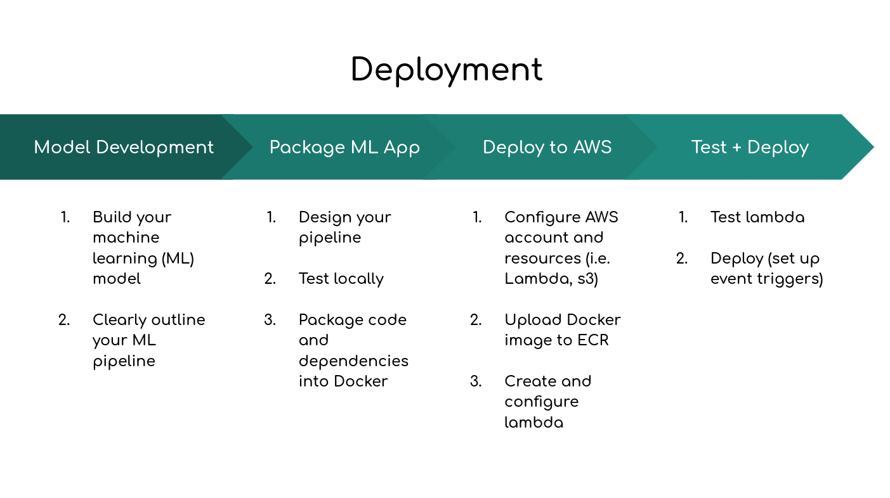

# DEPLOY-NPL-MODEL
Basic ML project converted to MLOPs steps for deploying to AWS Lambda using Docker.

## ML Process
Basically went on Kaggle, and downloaded one with sufficient data.   

## How do I build the model?
Running on Ubuntu 20.04  
Have [conda](https://docs.conda.io/en/latest/miniconda.html) installed.  
Create env `conda create -n nlp_app` and then activate `conda activate nlp_app`.   
Install the requirements with `bash install_requirements.sh`.  
Build the model by running `python3 build_model.py` on the terminal.  

## How do I test the app?  
`RUNNING_LOCAL=True python3 -m app.main` or    
`RUNNING_LOCAL=True FILENAME=model-dev/data/emotion-labels-test.csv python -m app.main`
where `FILENAME` is any file with `text` in tconda env remove -n <environment_name>
in the header.  

## Directory structure

    deploy-python-ml/
    ├── app
    │   ├── model
    │   ├── preprocessing
    └── model-dev
        └── data

## Deployment

General steps to deploy your code include

1.  Build your machine learning model and pipeline
2.  Create/setup a AWS account
3.  Package your code in a Docker container  
--aws configure via AWS CLI toolkit  
--AWS auth `aws ecr get-login-password --region <your-region> | docker login --username AWS --password-stdin <your-account-id>.dkr.ecr.<your-region>.amazonaws.com`  
--build image `docker build -t deploy-nlp-app .`   
4.  Upload your Docker image to AWS Elastic Container Registry (ECR)  
--tag docker image `docker tag deploy-nlp-app:latest <your-account-id>.dkr.ecr.<your-region>.amazonaws.com/deploy-nlp-app:latest`  
--push docker image `docker push <your-account-id>.dkr.ecr.<your-region>.amazonaws.com/deploy-nlp-app:latest`  
5.  Create your AWS Lambda to run the ECR image  
6.  Run/test/configure your AWS Lambda  
7.  Deliver your results to others who may need the results  

